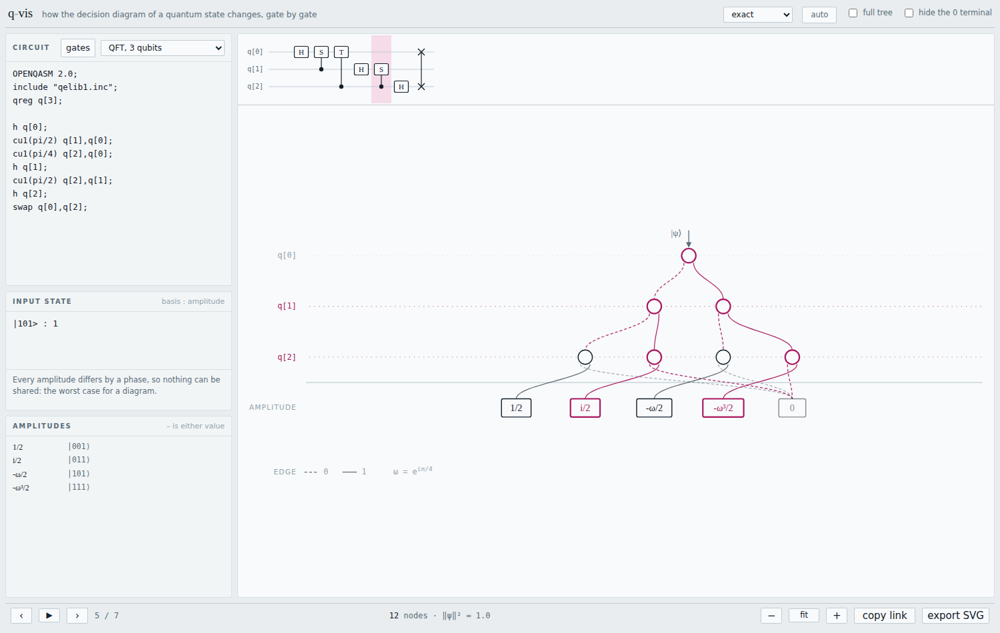

# q-vis

Watch the **MTBDD** of a pure quantum state change, gate by gate, as a unitary circuit is
applied to it.

[](https://github.com/QuantumFIT/q-vis/actions/workflows/ci.yml)

**[Try it →](https://quantum.fit.vut.cz/q-vis/)** — or download the single HTML file and
open it offline. No install, no server, no dependencies.



- **Circuit**: OpenQASM 2.0, unitary gates only.
- **Input state**: a sparse list of `basis pattern : amplitude`, concrete or **symbolic**.
- **Output**: a steppable, animatable diagram, with the nodes this gate created picked out
  in colour and the qubits it acted on marked on their rules.

Amplitudes are **exact**, in the ring `Z[1/√2, i]` extended with free symbols. Nothing is
rounded, and two states are equal precisely when their diagrams are the same node.

## Why a decision diagram

The point is what the structure costs. A uniform superposition over 8 qubits has 256 equal
amplitudes and is **one node**. A 5-qubit GHZ state is 11 nodes, growing by two per qubit;
the same state drawn as an unreduced tree is 63. A 3-qubit QFT gives every basis state a
different phase, so nothing can be shared and the diagram is as large as the state vector.
Grover on 4 qubits ends in **6 nodes**, because the state is symmetric in every unmarked
basis state and sharing captures exactly that — `13/256` on one shared terminal and
`-251/256` on the marked path, exactly, where a float simulator would say 0.98.

All of them are one click apart in the examples, and the **full tree** toggle draws any of
them unreduced for comparison.

## Writing the input state

One line per basis pattern. `-` matches either value of that qubit:

```
|00> : a                    # symbols are free variables
|11> : b
0-1  : 1/sqrt(2)            # a don't-care: 2 basis states, 1 line, 0 extra nodes
----------- : 1/2^5         # a 10-qubit uniform superposition — one terminal
```

Amplitudes are expressions over integers, `i`, `sqrt2`, `omega` (= e^{iπ/4}) and symbols,
combined with `+ - * / ^`. Division must stay exact: `1/2` and `1/(1+i)` are fine, while
`1/3` and `0.5` are refused with an explanation rather than silently rounded.

## Which gates work

Clifford+T and anything else whose matrix entries lie in the ring: `x y z h s sdg t tdg
sx sxdg`, controlled forms `cx cy cz ch cs csdg csx ct ctdg`, `swap iswap ccx ccz cswap`,
and `u1`/`p`/`cu1`/`cp` when the angle is a multiple of π/4 — enough for QFT.

`barrier` is accepted and drawn as a divider between steps in the circuit strip. It has
no effect on the state, since there is no compiler here for it to constrain.

Arbitrary rotations such as `rz(π/3)` are **deliberately unsupported**: their entries leave
the ring, which would cost both exactness and the property that equal states have identical
diagrams. `measure`, `reset` and classical control are rejected for a related reason — this
tool shows unitary evolution of a pure state.

## Reading the amplitudes

Amplitudes are shown exactly by default: `1/√2`, `(1-i)/2`, `ω` (explained on the plate
whenever it appears). The picker switches to floating point, either rectangular
(`0.5-0.5i`) or polar with the angle in degrees (`0.3536∠-45°`), radians
(`0.3536∠-0.7854`) or multiples of π (`0.3536∠-π/4`). Symbolic amplitudes keep their
symbols in every mode; only the coefficient changes: `0.7071a + 0.7071b`.

Polar is the one to reach for when a circuit only moves phase around — the 3-qubit QFT
prints as eight amplitudes of identical magnitude and eight different angles. Every angle
in this ring is a multiple of π/4, so the π form stays exact where the other two round.

## Sharing a view

**copy link** puts the whole view in the URL — circuit, input state, which gate you are
on, and how it is drawn (tree or reduced, zeros hidden or not, exact or numeric). Opening
that link reproduces exactly what you were looking at, which is what you want when
pointing at one step from lecture notes, an issue, or a paper. **export SVG** saves the
current diagram as a standalone figure, legend included.

## Conventions

Qubit *q* is decided at level *q*, so **qubit 0 is the top of the diagram and the leftmost
bit of the ket**: the path `0,1,1` from the root leads to the amplitude of `|011>`. Low (0)
edges are dashed, high (1) edges solid, and terminals hold amplitudes.

## Development

No dependencies and no build step while developing: `dev.html` loads the ES modules
directly, so a change is one reload away.

```sh
python3 -m http.server 8000    # then open http://localhost:8000/dev.html
node --test tests/*.test.js    # 62 tests, no node_modules
node tools/build.mjs           # -> q-vis.html, one self-contained file
```

Developed on Node 24. Nothing in the project needs more than Node 18, but pass the test
runner a glob rather than a directory — since Node 24 a bare directory is resolved as a
module.

The engine is tested against an independent dense state-vector simulator: random circuits
over the whole gate table, checked amplitude by amplitude after *every* gate, for concrete
and symbolic amplitudes alike. Two further checks use exactness in a way a floating-point
simulator could not — `U† U |ψ⟩` must return the *identical* node, and building the same
state by different routes must land on the same node.

`CLAUDE.md` records the conventions the code relies on and why, and is worth reading before
changing the algebra or the layout.

## Licence

MIT — see [LICENSE](LICENSE).
